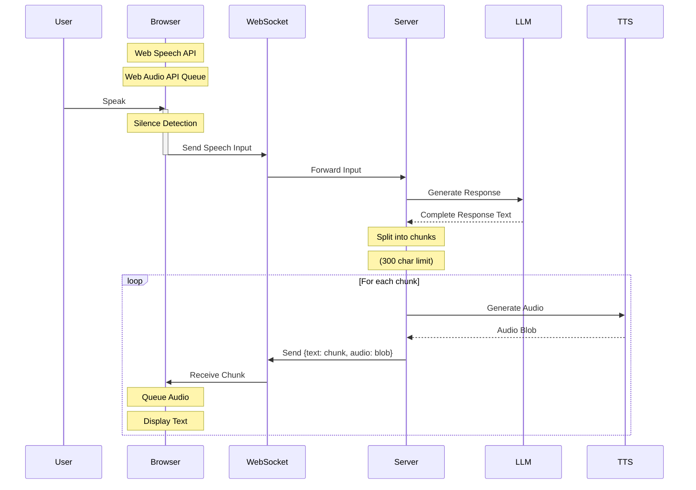
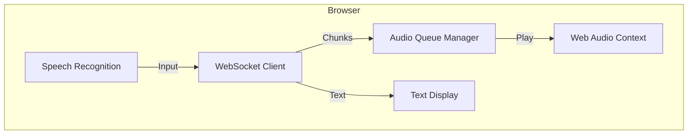
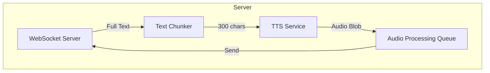

# Streaming Voice Channel Architecture

## Overview
This document outlines the architecture for the real-time voice interaction channel in our AI Sales Agent. The system enables natural conversation through voice with automatic silence detection and seamless audio response streaming.

## System Components

### Frontend Components
- WebSocket Client for real-time communication
- Web Speech API for voice input
- Web Audio API for audio playback
- Audio Queue Manager for sequential playback
- Text Display UI for visual feedback

### Backend Components
- WebSocket Server for bi-directional communication
- Text Chunker Service for response processing
- TTS Service Integration (smallest.ai)
- Audio Processing Queue

## Data Flow



## Component Details

### Frontend Architecture



### Backend Architecture



## Implementation Details

### 1. Speech Input Handler
- Utilizes Web Speech API for voice capture
- Implements silence detection (1.5s threshold)
- Auto-restarts recognition after input sent
- Handles voice input errors gracefully

### 2. Text Chunker Service
- Splits response text into 300-character chunks
- Preserves word boundaries during splitting
- Maintains text coherence
- Queues chunks for TTS processing

### 3. Audio Queue Manager
- Manages incoming audio blob queue
- Implements Web Audio API for playback
- Ensures sequential chunk playback
- Handles smooth transitions between chunks
- Manages playback state

### 4. WebSocket Communication

#### Client to Server Events
```typescript
{
  type: 'speech_input',
  data: string  // Transcribed speech text
}
```

#### Server to Client Events
```typescript
{
  type: 'response_chunk',
  data: {
    text: string,      // Chunk text content
    audio: Blob,       // Audio blob for chunk
    isLast: boolean    // Indicates final chunk
  }
}
```

## Error Handling

### Frontend
- Speech recognition fallbacks
- Audio playback error recovery
- WebSocket reconnection logic
- Queue state management

### Backend
- Chunk processing error handling
- TTS service error recovery
- WebSocket connection management
- Queue overflow prevention

## Performance Considerations

### Frontend
- Audio buffer management
- Memory usage optimization
- Smooth playback transitions
- UI responsiveness

### Backend
- Efficient chunk processing
- TTS request optimization
- WebSocket message handling
- Queue size management

## Future Enhancements
1. Adjustable chunk sizes based on content
2. Dynamic silence threshold
3. Audio quality improvements
4. Enhanced error recovery
5. Performance optimizations

## Notes
- This architecture focuses on functional implementation
- Maintains existing LLM integration
- Prioritizes real-time interaction
- Designed for rapid implementation