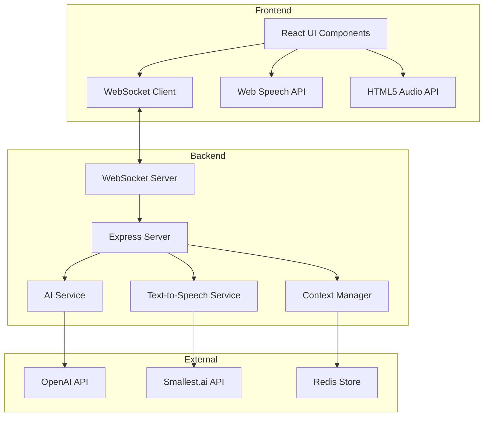
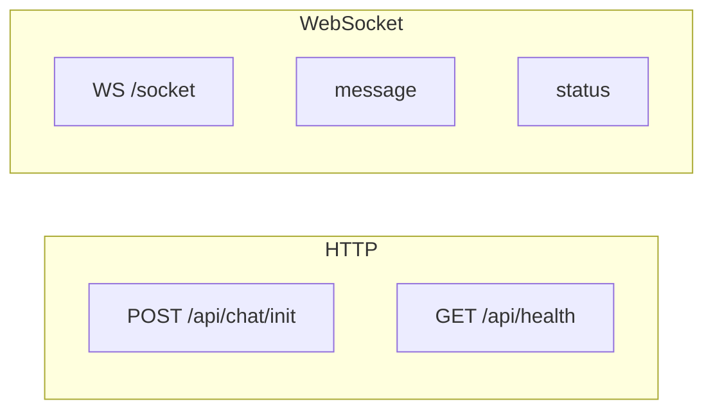

# AI Sales Agent Implementation Plan

## System Architecture



## Implementation Phases

### Phase 1: Project Setup and Basic Infrastructure (1-2 days)

1. Project Structure Setup
   ```
   sales-agent/
   ├── client/                 # Frontend React application
   │   ├── src/
   │   │   ├── components/     # React components
   │   │   ├── contexts/       # React contexts
   │   │   ├── hooks/         # Custom hooks
   │   │   ├── services/      # API services
   │   │   └── utils/         # Utility functions
   │   └── public/            # Static assets
   ├── server/                # Backend Node.js application
   │   ├── src/
   │   │   ├── config/       # Configuration
   │   │   ├── controllers/  # Route controllers
   │   │   ├── services/     # Business logic
   │   │   ├── models/       # Data models
   │   │   └── utils/        # Utility functions
   │   └── tests/           # Backend tests
   └── shared/              # Shared types and utilities
   ```

2. Development Environment Setup
   - Initialize frontend and backend projects
   - Set up TypeScript configurations
   - Configure ESLint and Prettier
   - Set up environment variables

### Phase 2: Frontend Implementation (2-3 days)

1. Landing Page Development
   ```mermaid
   graph TB
       subgraph Layout
           Header[Header with Logo]
           Hero[Hero Section]
           Features[Features Section]
           Chat[Chat Widget]
       end

       subgraph ChatWidget
           Input[Text/Voice Input]
           Messages[Message Display]
           Controls[Audio Controls]
       end

       Chat --> Input
       Chat --> Messages
       Chat --> Controls
   ```

2. Chat Interface Components
   - Minimizable chat widget
   - Message display area with typing indicators
   - Text input with voice toggle
   - Audio playback controls
   - Error states and offline indicators

3. Real-time Communication
   - WebSocket connection management
   - Automatic reconnection logic
   - Offline message queueing

### Phase 3: Backend Implementation (2-3 days)

1. Server Setup
   - Express.js application with TypeScript
   - WebSocket server configuration
   - Error handling middleware
   - Request validation

2. Core Services
   ```mermaid
   graph LR
       subgraph Services
           CM[Context Manager]
           AS[AI Service]
           TS[TTS Service]
       end

       subgraph External
           Redis[(Redis)]
           OpenAI[OpenAI]
           SmallestAI[Smallest.ai]
       end

       CM --> Redis
       AS --> OpenAI
       TS --> SmallestAI
   ```

3. Context Management
   - Redis integration for conversation storage
   - Session management
   - Context pruning and cleanup

### Phase 4: AI Integration (2-3 days)

1. OpenAI Integration
   - Prompt engineering for sales agent persona
   - Context window management
   - Response streaming

2. Voice Processing
   - Web Speech API integration
   - Smallest.ai TTS integration
   - Audio streaming and caching

### Phase 5: Error Handling and Recovery (1-2 days)

1. Frontend Error Handling
   - Connection status indicators
   - Retry mechanisms
   - Offline mode support
   - Error messages and notifications

2. Backend Error Handling
   - API error handling
   - WebSocket connection recovery
   - Rate limiting
   - Service fallbacks

### Phase 6: Testing and Optimization (2-3 days)

1. Testing
   - Unit tests for critical components
   - Integration tests for API endpoints
   - End-to-end testing of chat flow
   - Performance testing

2. Optimization
   - Response time optimization
   - Audio latency reduction
   - Memory usage optimization
   - Load testing and scaling

## Technical Specifications

### Frontend Technologies
- React 18 with TypeScript
- Socket.io-client for WebSocket
- Web Speech API for voice input
- HTML5 Audio API for voice output
- TailwindCSS for styling
- React Query for data management

### Backend Technologies
- Node.js with Express
- Socket.io for WebSocket server
- Redis for context storage
- OpenAI API integration
- Smallest.ai API integration
- TypeScript for type safety

### API Endpoints



### WebSocket Events
- `connect`: Initial connection
- `message`: Chat messages
- `typing`: Typing indicators
- `status`: Connection status
- `error`: Error events

### Error Handling Strategy
1. Connection Issues
   - Automatic reconnection with exponential backoff
   - Offline message queueing
   - Status indicators in UI

2. API Failures
   - Retry mechanisms for failed requests
   - Fallback responses
   - User-friendly error messages

3. Resource Issues
   - Memory usage monitoring
   - Cache management
   - Performance degradation handling

## Timeline and Milestones

1. Week 1
   - Project setup and infrastructure
   - Basic frontend implementation
   - WebSocket integration

2. Week 2
   - Backend services implementation
   - AI and voice integration
   - Initial testing

3. Week 3
   - Error handling implementation
   - Performance optimization
   - Final testing and deployment

## Future Enhancements
1. Integration with additional channels (WhatsApp, Slack, Email)
2. Advanced analytics and reporting
3. Multi-language support
4. Custom voice model training
5. A/B testing for different sales approaches